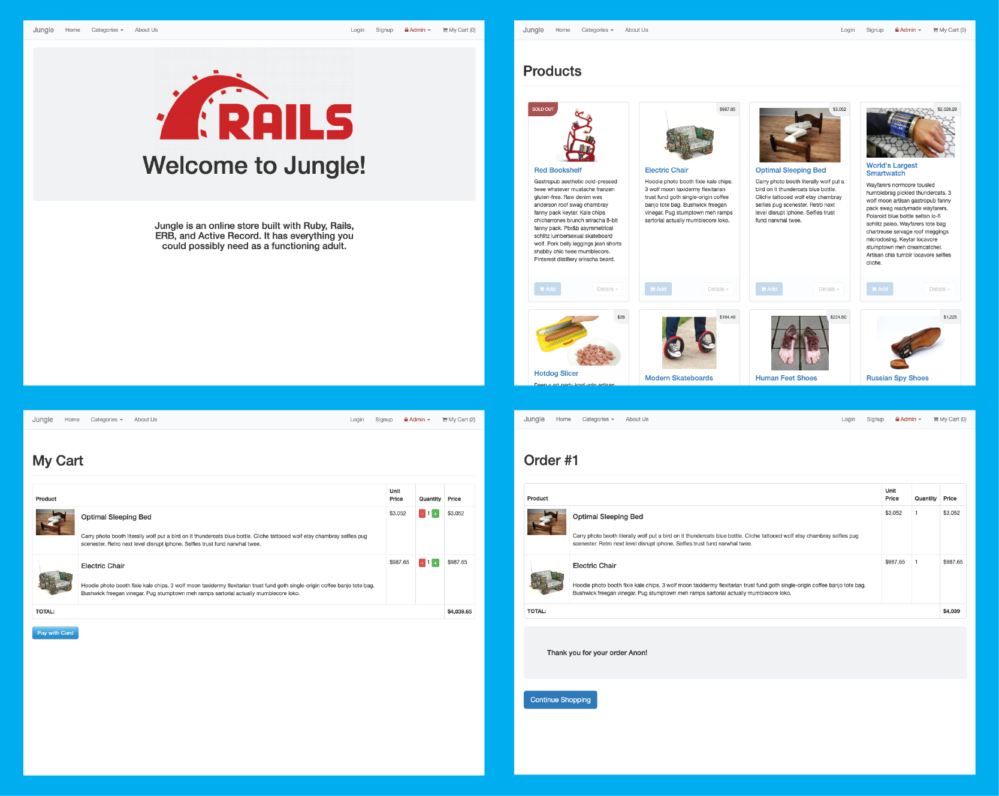
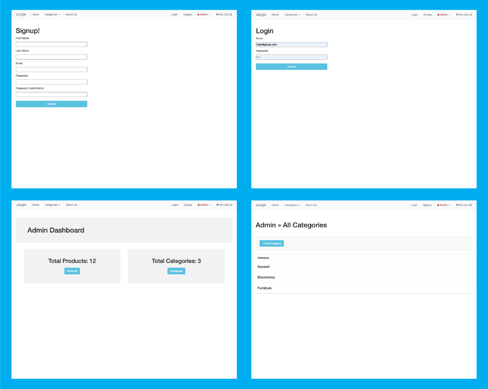

# Jungle

A mini e-commerce application built with Rails 4.2, tested with rspec, capybara.

This was a project done during my time at the Lighthouse Labs bootcamp for the purpose of learning Ruby/Rails

---

## I was responsible for learning the code-base of this partially completed application so that I could make the following changes:

---

### adding new pages:

- categories page
- admin dashboard page
- home page
- order details page

### adding new features:

- sold out badge
- allowing admins to create new categories for products
- user authentication

### fixing bugs:

- added missing admin security
- prevent users from checking out with an empty cart

### creating tests for these features using rspec and capybara

- testing user login/signup
- testing homepage and links
- testing 'add to cart' functionality

---

## v SCREENSHOTS v

---

## Additional Steps for Apple M1 Machines

1. Make sure that you are runnning Ruby 2.6.6 (`ruby -v`)
1. Install ImageMagick `brew install imagemagick imagemagick@6 --build-from-source`
1. Remove Gemfile.lock
1. Replace Gemfile with version provided [here](https://gist.githubusercontent.com/FrancisBourgouin/831795ae12c4704687a0c2496d91a727/raw/ce8e2104f725f43e56650d404169c7b11c33a5c5/Gemfile)

## Setup

1. Run `bundle install` to install dependencies
2. Create `config/database.yml` by copying `config/database.example.yml`
3. Create `config/secrets.yml` by copying `config/secrets.example.yml`
4. Run `bin/rake db:reset` to create, load and seed db
5. Create .env file based on .env.example
6. Sign up for a Stripe account
7. Put Stripe (test) keys into appropriate .env vars
8. Run `bin/rails s -b 0.0.0.0` to start the server

## Stripe Testing

Use Credit Card # 4111 1111 1111 1111 for testing success scenarios.

More information in their docs: <https://stripe.com/docs/testing#cards>

## Dependencies

- Rails 4.2 [Rails Guide](http://guides.rubyonrails.org/v4.2/)
- PostgreSQL 9.x
- Stripe
